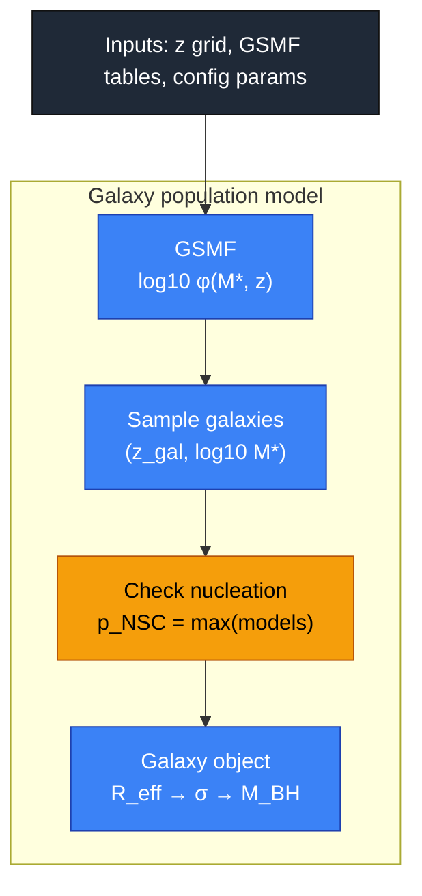
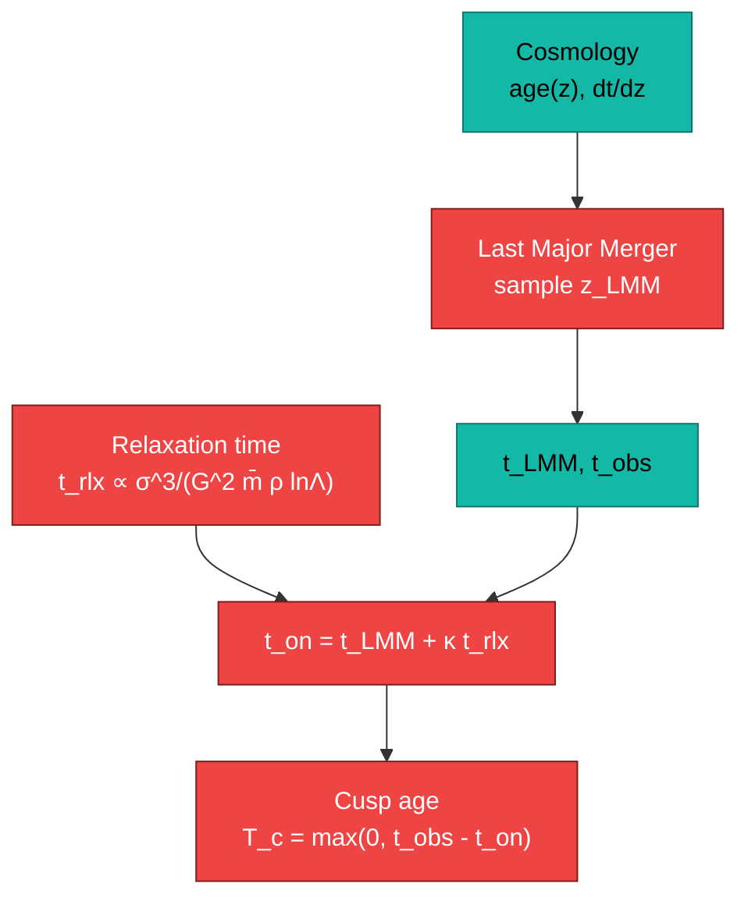
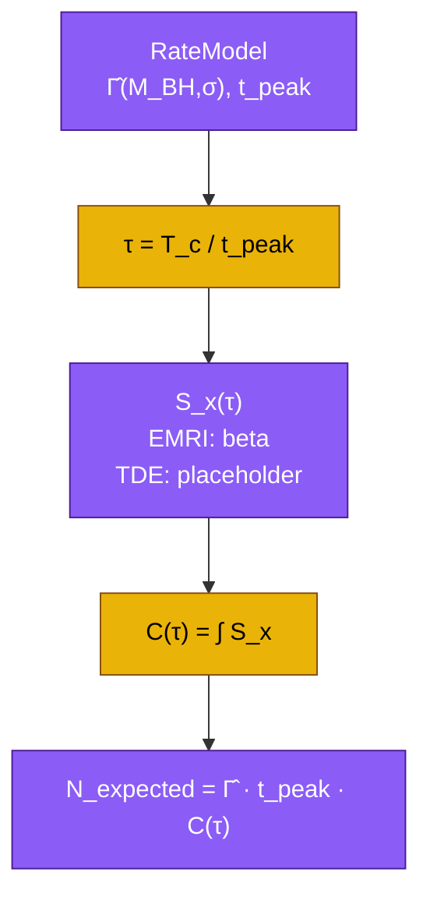

```mermaid
flowchart TD
  classDef process fill:#10b981,color:#000,stroke:#065f46;
  classDef decision fill:#f59e0b,color:#000,stroke:#b45309;
  classDef highlight fill:#6366f1,color:#fff,stroke:#312e81;

  B1["NSC(galaxy)\nM_BH fixed"]:::process
  B2["r_infl = G M_BH / σ^2"]:::process
  B3["r_a = 4 r_infl"]:::process
  B4{"Channel?"}:::decision

  B5["EMRI cutoff\nr_k = 8GM/c^2"]:::highlight
  B6["TDE cutoff\nr_k ≈ tidal radius"]:::highlight

  C1["Dehnen profile n(r)"]:::process
  C2["ρ(r_infl)"]:::process

  B1 --> B2 --> B3 --> B4
  B4 -->|EMRI| B5 --> C1
  B4 -->|TDE|  B6 --> C1
  C1 --> C2
```






